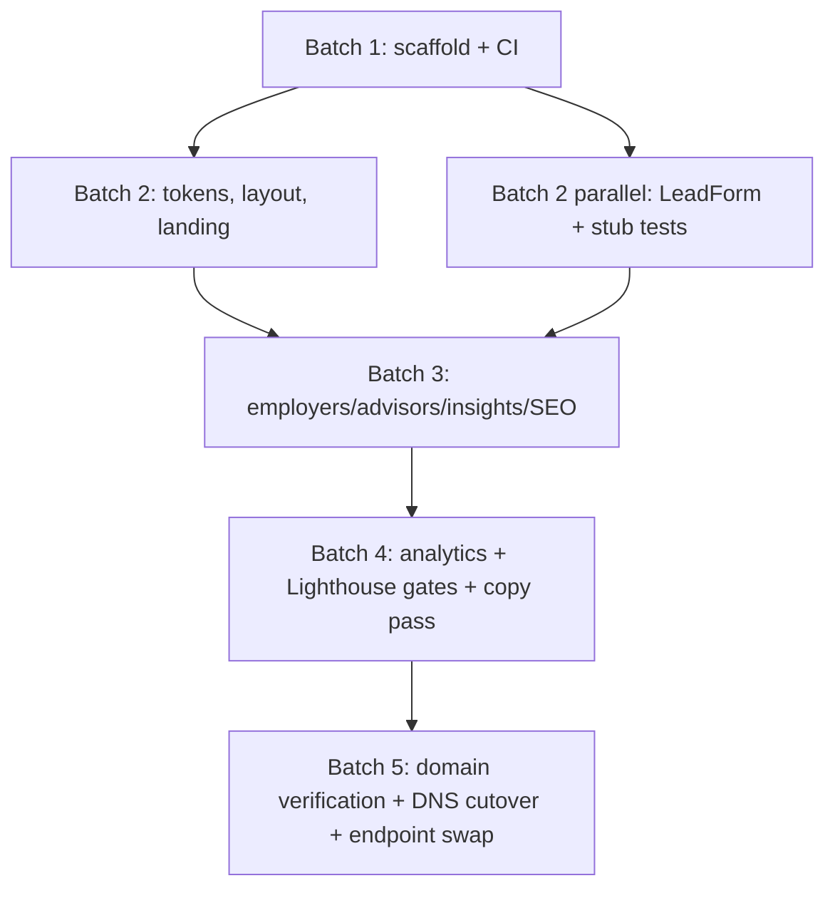

# Compiled Project Plan

Verification tiers: **V1** = CI gates pass (build/lint/content greps),
**V2** = behavioral tests (component/e2e/Lighthouse), **V3** = human review
(copy, brand, launch checklist).

## Dependency DAG

## Batch 1 — Foundation (serial)

| Task                                                                 | Verify                                                      |
| -------------------------------------------------------------------- | ----------------------------------------------------------- |
| 1.1 Create private repo, branch protection, Dependabot               | V3: settings screenshot/checklist                           |
| 1.2 Next.js scaffold, `output: 'export'`, TS strict, ESLint/Prettier | V1                                                          |
| 1.3 Deploy workflow: pinned SHAs, minimal permissions, Pages preview | V1 + V3: workflow review                                    |
| 1.4 CI content gates: pricing grep, naming grep, CNAME assert        | V1 (gate proves itself on a seeded violation, then removed) |

## Batch 2 — Brand + landing (parallelizable)

| Task                                                                            | Verify                                       |
| ------------------------------------------------------------------------------- | -------------------------------------------- |
| 2.1 `tokens.css` palette/type tokens; fonts via `next/font`; logo PNGs vendored | V1 + V3: brand checklist vs guide §§5–6      |
| 2.2 Landing page sections (hero wash, offer ladder, analyze, why, numbers, CTA) | V2: renders, links resolve; V3: copy         |
| 2.3 LeadForm: POST to env endpoint, honeypot, fail-loud error + mailto          | V2: 201/5xx/network/honeypot component tests |

## Batch 3 — Full IA (parallelizable)

| Task                                                           | Verify                |
| -------------------------------------------------------------- | --------------------- |
| 3.1 `/employers` page                                          | V2 + V3               |
| 3.2 `/advisors` page                                           | V2 + V3               |
| 3.3 `/insights` MDX scaffold, typed frontmatter                | V1                    |
| 3.4 SEO: metadata, OG cards (badge-bone mark), sitemap, robots | V2: metadata snapshot |

## Batch 4 — Instrumentation + quality (serial, short)

| Task                                                                     | Verify |
| ------------------------------------------------------------------------ | ------ |
| 4.1 Analytics snippet (async; site works when blocked)                   | V2     |
| 4.2 lychee link check + Lighthouse CI (a11y ≥ 95, perf ≥ 90) in workflow | V1     |
| 4.3 Owner copy pass                                                      | V3     |

## Batch 5 — Launch (serial, owner-gated)

| Task                                                                    | Verify                           |
| ----------------------------------------------------------------------- | -------------------------------- |
| 5.1 Org domain verification for getgroundedhealth.com                   | V3: recorded before 5.2          |
| 5.2 Custom domain + CNAME + owner sets GoDaddy records; `verify-dns.sh` | V2: script green; HTTPS enforced |
| 5.3 Swap `NEXT_PUBLIC_LEADS_ENDPOINT` to live endpoint (`t_807942b3`)   | V2: e2e against prod endpoint    |

## Standing rules for executing agents

- No raw hex colors outside `tokens.css`; no gradients except the sanctioned
  hero wash; never recolor the hippo mark.
- No server-only Next.js features — if a task seems to need one, stop and
  re-plan rather than adding a runtime.
- Copy follows brand-guide voice: lead with the number, short sentences,
  "you", cite sources, no pricing numerals, never "HippoHealth".
- Form and any future degraded path must fail loud — visible error states,
  never fabricated success.
