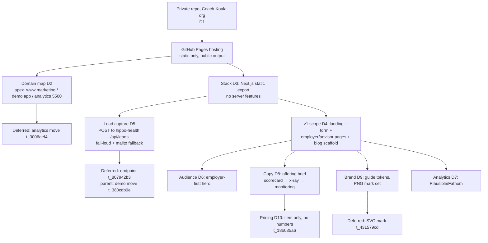

# Decision Tree

## Resolution order

1. **Hosting constraints first** (D1, D2): private repo + Pages fixes the
   deployment model (static, public output) and forces the domain split.
2. **Stack under those constraints** (D3): static export is the binding
   restriction; Next.js chosen for the later SSR path.
3. **Capture under the static constraint** (D5, D12): no backend on Pages →
   external endpoint; owner chose first-party (hippo-health) over third-party.
4. **Content decisions** (D4, D6, D8, D10): offering brief overrides the older
   deck framing; employer-first; outcome-led.
5. **Brand and instrumentation leaves** (D9, D7): fully specified by the
   existing brand guide; no open questions.

## Deferred decisions (tracked)

| Item                               | Task         | Blocks                             |
| ---------------------------------- | ------------ | ---------------------------------- |
| hippo-health `/api/leads` endpoint | `t_807942b3` | live form submissions (not launch) |
| App → `demo.` subdomain            | `t_380cdb9e` | endpoint URL stability             |
| 5500 → `analytics.` subdomain      | `t_3006aef4` | nothing in grounded_web            |
| SVG hippo mark                     | `t_431579cd` | nothing (PNG set suffices)         |
| Final pricing copy                 | `t_18b035a6` | pricing numbers on site            |
