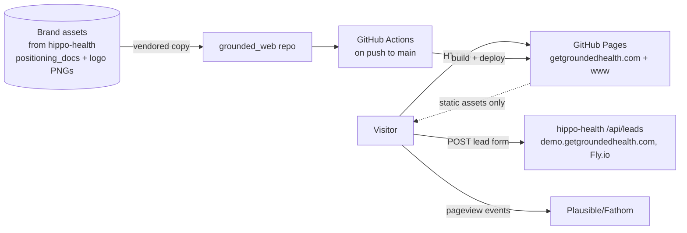
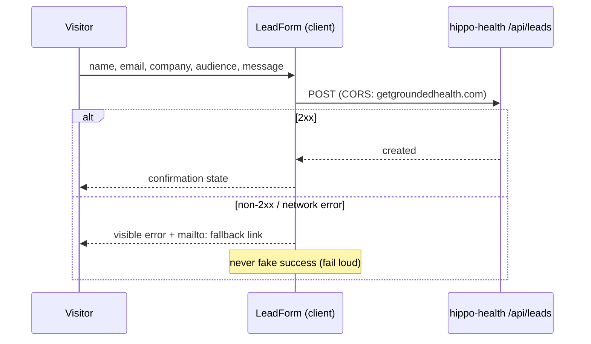

# Architecture Overview

## Current state

Greenfield. This repo contains only blueprint specs; no application code yet.

## Recommended architecture

### System context



Trust boundaries: the browser↔leads-endpoint hop is the only cross-origin
write; everything else is static delivery. See `threat-model.md`.

### Stack

| Layer | Choice | Notes |
|---|---|---|
| Framework | Next.js (App Router), `output: 'export'` | static export gate in CI; no middleware/ISR/API routes/`next/image` optimizer |
| Styling | Tailwind CSS with brand tokens as CSS custom properties | tokens are the single source of truth (`src/styles/tokens.css`) |
| Fonts | Inter + JetBrains Mono via `next/font` (self-hosted at build) | no runtime font CDN calls |
| Content | MDX content collection for blog/insights | launches empty; typed frontmatter |
| Forms | Client component POSTing to `NEXT_PUBLIC_LEADS_ENDPOINT` | fail-loud UI + `mailto:` fallback |
| Analytics | Plausible or Fathom snippet | no cookies, no consent banner |
| CI/CD | GitHub Actions → `actions/deploy-pages` | `public/CNAME` = `getgroundedhealth.com` |

### Repository layout

```
grounded_web/
├── src/
│   ├── app/                  # routes: /, /employers, /advisors, /insights
│   ├── components/           # Hero, OfferLadder, StatBlock, LeadForm, ...
│   ├── content/insights/     # MDX posts (empty scaffold at launch)
│   └── styles/tokens.css     # brand palette + type tokens
├── public/
│   ├── CNAME
│   ├── logo/                 # vendored grounded-mark / badge PNG set
│   └── robots.txt
├── specs/                    # this blueprint
└── .github/workflows/deploy.yml
```

### Information architecture (v1)

| Route | Purpose | Key sections |
|---|---|---|
| `/` | Employer-first landing | Hero (teal-to-bone wash, "See where your health plan is leaking money."), offer ladder (Free Scorecard → Claims X-Ray → Continuous Monitoring), "What we analyze" (claims & pharmacy spend, vendor performance, contract terms, benchmarking), "Why Grounded" (independent-auditor framing), numbers/evidence band, CTA: **Get your free scorecard** |
| `/employers` | Employer depth page | HR-lightweight framing ("what are you doing for me?"), email/Slack reporting, vendor accountability, contract review |
| `/advisors` | Advisor audience page | Peer-to-peer tone, decision/negotiation support, benchmarking when clients are shopping |
| `/insights` | Blog scaffold | evidence-led posts; cite sources (KFF, Mercer, Health Affairs) |
| pricing section (on `/` or `/employers`) | Tier framing only | free scorecard / performance-based scan / annual monitoring — **no dollar amounts** (D10) |

Depth strategy (per offering brief): website stays stylized and high-level;
the lead-magnet PDF carries partial findings; the authenticated app
(demo.getgroundedhealth.com) holds the full scorecard.

### Lead capture data flow



Endpoint contract and CORS are tracked in hippo-health task `t_807942b3`.

### DNS / launch records (GoDaddy, owner-managed)

| Record | Host | Value |
|---|---|---|
| A ×4 | `@` | 185.199.108.153 / 109.153 / 110.153 / 111.153 |
| AAAA ×4 | `@` | 2606:50c0:8000::153 … :8003::153 |
| CNAME | `www` | `coach-koala.github.io` |
| CNAME | `demo` | Fly app hostname (task `t_380cdb9e`) |
| CNAME | `analytics` | Vercel (task `t_3006aef4`) |

Also required: verify `getgroundedhealth.com` as a domain in Coach-Koala org
settings (prevents Pages domain takeover), set the custom domain in repo Pages
settings, enforce HTTPS.

## Explicitly out of scope (v1)

- Any server runtime in this repo (search, personalization, gated content)
- The lead-magnet PDF generator (lives with the scorecard pipeline)
- Pricing numbers (D10, `t_18b035a6`)
- Localization

## Skipped blueprint phases

- **DSM analysis:** no code yet; run after the first implementation sprint.
- **Pipeline defense:** folded into `threat-model.md` (workflow permissions,
  pinned actions) — a dedicated audit is premature for one workflow file.
